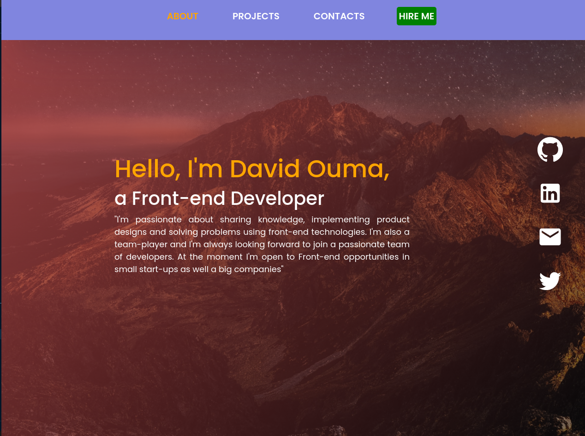

# Portfolio v2.0

This is the second version of my Portfolio that I built using ReactJs. This Portfolio also has updated projects that I have curated together to show my skills in different languages and frameworks


## Built With

- ReactJS
- CSS

## Live Demo

- Check it out on [Netlify](https://daudi.netlify.app/Projects)

## Getting Started

To get a local copy up and running follow these simple example steps.

### Prerequisites

A Web Browser (preferably Google Chrome)

### Setup

- Clone the GitHub Repository
- Go to the Project Directory
- Run ```yarn install```

### Usage

In the project directory, you can run:

```npm start```

Runs the app in the development mode.<br>
Open http://localhost:3000 to view it in your browser.

## Authors

👤 **Author 1**

- GitHub: [daudi13](https://github.com/daudi13)
- Website: []()
- LinkedIn: [LinkedIn]()

## 🤝 Contributing

Contributions, issues, and feature requests are welcome!

Feel free to check the [issues page](../../issues/).

## Show your support

Give a ⭐️ if you like this project!

## 📝 License

This project is [MIT](./LICENSE) licensed.
